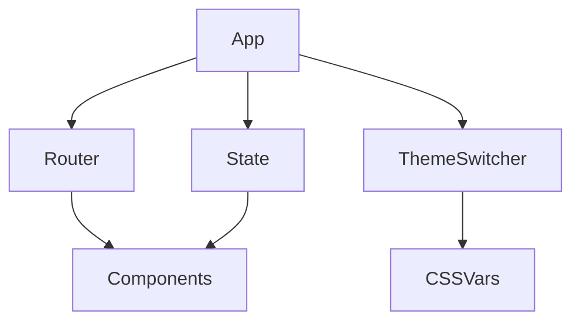

# Frontend Framework Demo

## Project Overview
This project is a modern, modular frontend framework for rapid SPA 
development with a showcase of real-world widgets and demo pages. 
It features theme switching, SPA routing, global and persistent state, event delegation, and a set of ready-to-use components. The example app demonstrates few best practices and integration of all core modules.

## Documentation

- [Features & Examples](docs/features.md)
- [Extending the Framework](docs/extending.md)
- [Architecture Details](docs/architecture.md)
- [Best Practices](docs/best-practices.md)


## Directory Structure
- `framework/` — Core framework modules (state, router, events, dom, persistentState, etc.)
- `framework/docs/` — Documentation and usage examples
- `example/` — Demo application with real widgets and pages
  - `components/` — All example widgets and demo components
  - `main.js` — Entry point for the example app
  - `index.html` — Main HTML file
  - `styles.css` — Example styles and theming
- `node_modules/` — Project dependencies (auto-installed)
- `.gitignore` — Git ignore rules
- `eslint.config.js` — ESLint configuration
- `favicon.ico` — Favicon for the app
- `jsconfig.json` — JS project config (for IDEs)
- `package.json` — Project metadata and scripts
- `package-lock.json` — Dependency lock file
- `server.js` — Simple server for local development

## Installation
1. **Clone the repository:**
   ```bash
   git clone <repo-url>
   cd frontend-framework
   ```
2. **Install dependencies:**
   ```bash
   npm install
   ```

##  Getting Started
- **Run the example app locally:**
  ```bash
  npm run starts
  ```
  The app will be available at [http://localhost:3000](http://localhost:3000)

## How to Use
- Explore the demo widgets and pages at the provided routes (see documentation for full list)
- Modify or add components in `example/components/` to extend the demo
- Core framework code is in `framework/` — see `docs/` for API and usage
- Persistent state is enabled by default (see `framework/persistentState.js`)
- Theming, routing, and state management are fully integrated and ready to use

---
For more details, see the documentation in `framework/docs/` and the code comments in each module.

## Architecture (Overview)



