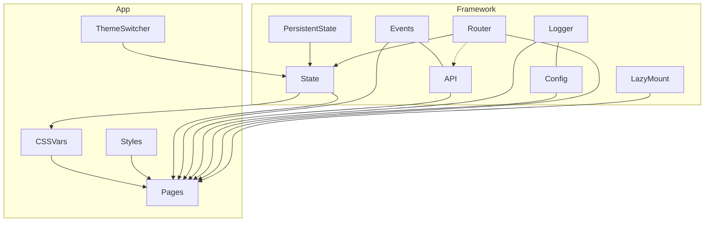
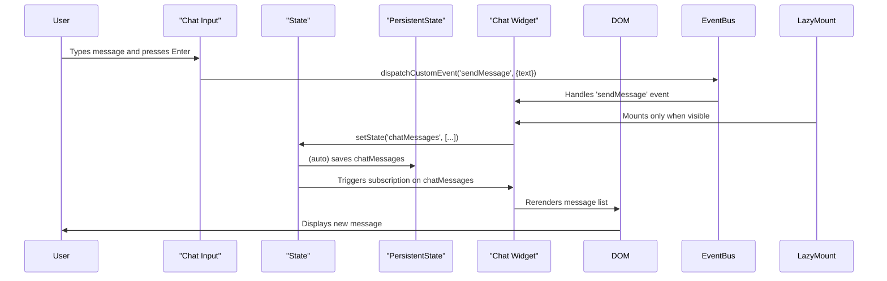

# Architecture

## Framework Modules and Responsibilities

| File/Module                | Module Name         | Responsibility/Description                                      |
|----------------------------|--------------------|-----------------------------------------------------------------|
| `api.js`                   | API                | Helpers for HTTP requests and external APIs                     |
| `components.js`            | Components         | Component system, `defineComponent`, rendering                  |
| `config.js`                | Config             | Centralized configuration (themes, endpoints, options)          |
| `dom.js`                   | DOM                | DOM utilities, manipulation                                     |
| `events.js`                | Events             | Event system for delegation and global communication            |
| `logger.js`                | Logger             | Unified logging for debugging and error reporting               |
| `persistentState.js`       | PersistentState    | Saves and restores global state between sessions (localStorage) |
| `router.js`                | Router             | SPA routing, navigation, and dynamic page rendering             |
| `state.js`                 | State              | Centralized, reactive global state for all app data             |
| `utils/request.js`         | Utils/Request      | HTTP requests and helpers                                       |
| `utils/lazyMount.js`       | LazyMount / LazyImageLoader | Handles lazy rendering of components and images using IntersectionObserver (see `framework/utils/lazyMount.js`). Used on Icon Demo and Performance pages, on Dashboard for Weather and Chat widgets. Also prepares SPA for any future heavy widgets or long lists. |

## Example Project Structure

- components/ — Example widgets and pages
- index.html — Entry point
- main.js — App bootstrap and routing
- public/ — Static assets
- styles.css — Main styles

## Design Principles
- Modularity: Each feature is a separate module.
- Extensibility: Easy to add new widgets, pages, or features.
- Simplicity: Minimal, clear API and structure.

## Architecture Diagram

## How App Uses Framework Modules
- **PersistentState:** Saves and restores global state between sessions (localStorage).
- **State:** Centralized, reactive global state for all app data.
- **Events:** Event system for delegation and global communication.
- **API:** Helpers for HTTP requests and external APIs.
- **Logger:** Unified logging for debugging and error reporting.
- **Config:** Centralized configuration (themes, endpoints, options).
- **Router:** SPA routing, navigation, and dynamic page rendering.
- **ThemeSwitcher:** UI for changing themes, updates state and CSSVars.
- **CSSVars:** CSS variables for theming, updated from state.
- **Styles:** Global and page-specific styles.
- **Pages:** All app pages (Dashboard, Chat, Weather, etc.), each can use widgets and framework modules.
- **LazyMount:** and **LazyImageLoader:** Handles lazy rendering of components. 

## Data Flow Example: Chat Widget

A real-world example of how data flows through the framework using the Chat widget.

**Step-by-step:**
0. Chat widget is mounted via `lazyMount` only when it enters the viewport (if using `/dashboard` route).
1. **User** types a message and presses Enter in the chat input.
2. **Chat Input** dispatches a custom event (`sendMessage`) via the EventBus.
3. **Chat Widget** listens for this event, adds the message to global state (`setState('chatMessages', ...)`).
4. **State** updates, and **PersistentState** automatically saves the new messages.
5. **Chat Widget** is subscribed to `chatMessages` and rerenders the DOM when state changes.
6. **User** sees the new message in the chat window.

**Where implemented:**
- `example/components/extra/Chat.js` — input handling, event dispatch, state subscription, rendering.
- `framework/state.js`, `framework/persistentState.js` — state storage and autosave.
- `framework/events.js` — EventBus and custom events.
- `framework/utils/lazyMount.js` — lazy rendering utilities.

## Data Flow Example
1. **User input:** User interacts with a widget (e.g., submits a form).
2. **Event:** Event is handled via Events or the component's event handler.
3. **Processing:** Data is processed, possibly using API or updating State.
4. **State update:** State is updated via setState.
5. **UI update:** Pages/components subscribed to state changes re-render automatically.
6. **Persistence:** If needed, PersistentState saves the new state.
 
 