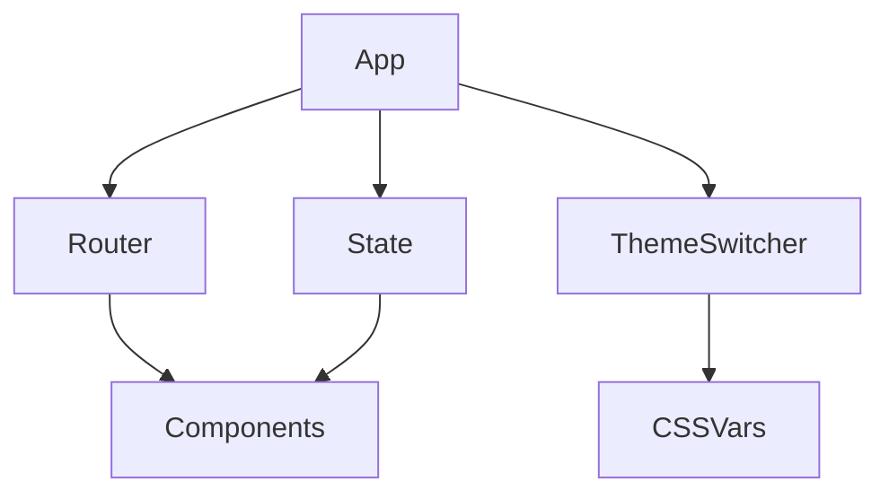

# Architecture

## Framework Directory Structure

- api.js — API helpers
- components.js — Component system
- config.js — Centralized configuration
- dom.js — DOM utilities
- events.js — Event system
- logger.js — Logging utilities
- persistentState.js — Persistent state
- router.js — SPA router
- state.js — Global state
- utils/request.js — HTTP requests and helpers

## Example Project Structure

- components/ — Example widgets and pages
- index.html — Entry point
- main.js — App bootstrap and routing
- public/ — Static assets
- styles.css — Main styles

## Design Principles
- Modularity
- Extensibility
- Simplicity

## Architecture Diagram

