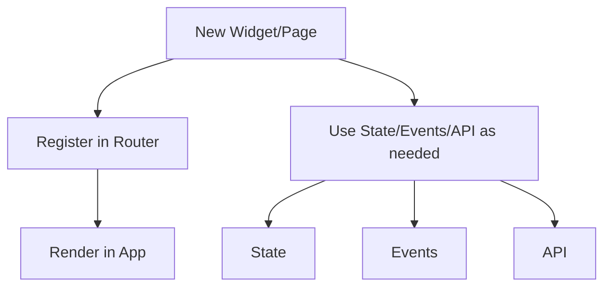

# Extending the Framework

## Integration of Modules

The main modules (state, router, events, dom, persistentState) are tightly integrated on pages and in widgets. For example, the Dashboard uses state to store tasks, events for event delegation, dom for rendering, and persistentState for autosaving.

## How to Add a New Widget or Page

### Process Diagram



### Explanation

To add a new widget, page, or event handler, you need to:
- Create a new component (widget or page) via defineComponent.
- Add a route via registerRoute.
- Attach an event handler via EventBus or delegateEvent. Use the required modules (State, Events, API, etc.) as needed in your component.
- The component will appear in the SPA and work alongside the others.


## Creating a New Component: Files and Example

To create a new widget or page, you typically use the following framework files:
- `framework/components.js` — for `defineComponent` and component registration
- `framework/dom.js` — for DOM helpers (e.g., `createElement`, `setTextContent`, `appendChild`)

### Minimal Example: Simple Widget
```js
// example/components/MySimpleWidget.js
import { defineComponent } from 'framework/components.js';
import { createElement, setTextContent, appendChild } from 'framework/dom.js';

export function MySimpleWidget() {
  // Create a simple DOM structure
  const container = createElement('div');
  setTextContent(container, 'Hello from MySimpleWidget!');

  // Return the component definition
  return {
    tag: 'div',
    props: { class: 'my-simple-widget' },
    children: [container]
  };
}

defineComponent('MySimpleWidget', MySimpleWidget);
```

- Import `defineComponent` from `components.js` to register your widget.
- Use DOM helpers from `dom.js` to build your UI.
- Export your function and register it with `defineComponent`.

You can now register a route for it using the router module (`framework/router.js`).

## Registering a New Route
```js
// Import the route registration function and your component
import { registerRoute } from 'framework/router.js';
import { renderComponent } from 'framework/components.js';
import { MySimpleWidget } from 'example/components/MySimpleWidget.js';

// Register the route (e.g., '/my-widget')
registerRoute('/my-widget', () => {
  renderComponent('MySimpleWidget', {}, document.getElementById('app'));
});
```
- Now, when you navigate to `/my-widget`, your new page/component will be rendered in the app root.
- You can add as many routes as you need for different pages or widgets.

## Using Events

You can use the events module (`framework/events.js`) for both local event delegation and global event communication.

### Example 1: Event Delegation (local)
```js
import { delegateEvent } from 'framework/events.js';
import { defineComponent } from 'framework/components.js';

export function ButtonDemo() {
  return {
    tag: 'div',
    children: [
      { tag: 'button', props: { 'data-action': 'say-hello' }, children: 'Say Hello' }
    ],
    lifecycle: {
      mount(node) {
        // Delegate click event for the button
        delegateEvent(node, 'click', '[data-action="say-hello"]', () => {
          alert('Hello!');
        });
      }
    }
  };
}
defineComponent('ButtonDemo', ButtonDemo);
```

### Example 2: Global Events with EventBus
```js
import { EventBus } from 'framework/events.js';

// In one component: emit a global event
EventBus.emit('customEvent', { message: 'Hello from A!' });

// In another component: listen for the event
EventBus.on('customEvent', (data) => {
  console.log('Received:', data.message);
});
```
- Use **event delegation** for handling events on dynamic or multiple elements inside your component.
- Use **EventBus** for communication between different components or for global events.

**Summary:**
- The framework provides infrastructure (state, events, router, persistentState, API, logger, config, theme).
- The SPA consists of pages and widgets that use these modules.
- Dashboard is an aggregator of widgets, one of the pages.
- ThemeSwitcher is a regular component that changes state and thus affects the theme.
- Adding a new element means registering a new component and integrating it via Router.

Happy coding!